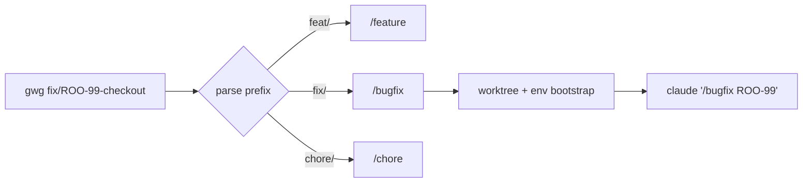
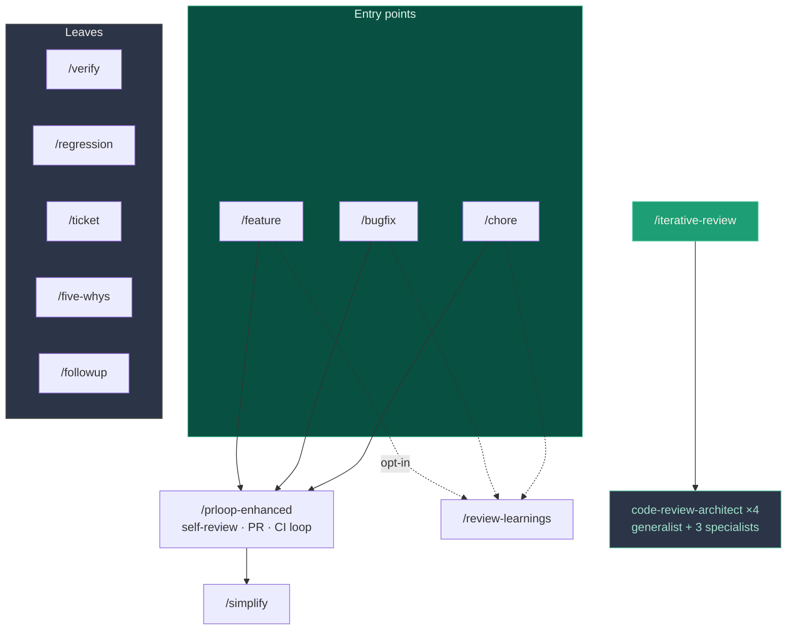
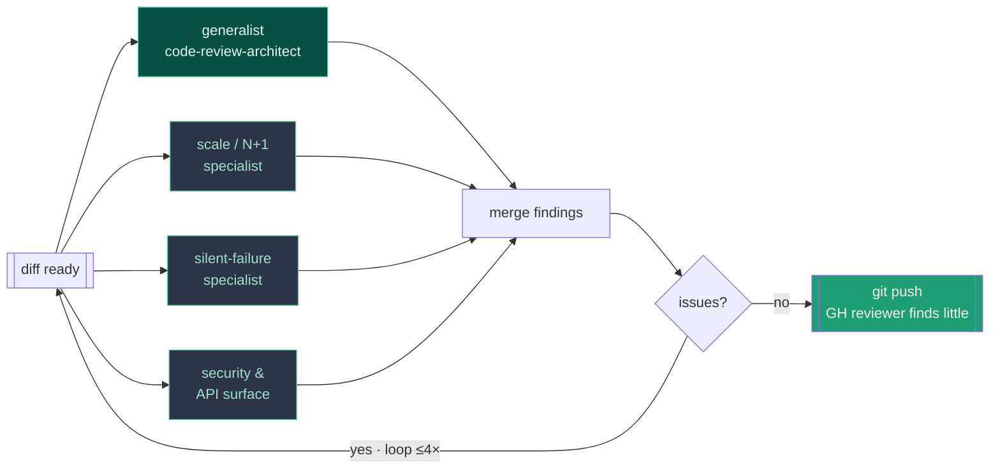
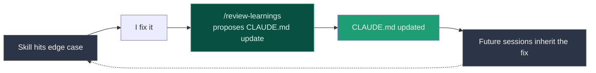

# Composable SDLC Automation
## with skills (and scripts, and hooks, and rules, etc)

<div class="mt-12 opacity-80">Craig Sturgis · vibecto.ai</div>

<div class="abs-br m-6 text-sm opacity-60">April 2026</div>

<!--
- Hi, I'm Craig. I run vibecto.ai.
- Today: how I wired up skills, hooks, CLAUDE.md, and GitHub Actions around Claude Code to automate most of my SDLC.
- This is one person's setup in one repo. Take what's useful, argue with the rest.
- Shape: opening receipt, rewind through the layers, honest tradeoffs, Q&A.
-->

---
layout: center
class: text-center
---

# The receipt

<div class="grid grid-cols-3 gap-10 mt-10"><div><div class="big-stat">540</div><div class="big-stat-label">items shipped in Q1 2026</div></div><div><div class="big-stat">745</div><div class="big-stat-label">PRs merged</div></div><div><div class="big-stat">60</div><div class="big-stat-label">Working days</div></div></div>

<div class="mt-12 text-xl opacity-80">Just me. One low-impact incident.</div>

<div class="mt-6 text-sm opacity-50"><a href="https://vibecto.ai/resources/540-issues-q1-agentic-pace">vibecto.ai/resources/540-issues-q1-agentic-pace</a></div>

<!--
- Q1 2026. Solo. Full data platform migration, partner API from zero, UX work, security fixes.
- 99 bugs. 13 critical security vulns. 25 UX improvements.
- One low-impact incident across the whole quarter.
- Not a brag. This is the setup I want to show you — everything else is downstream.
-->

---

# The footnote on that receipt

<div class="text-xl opacity-80 mt-4">None of those 540 were giant features. I ship in small pieces.</div>

<div class="mt-8 text-base space-y-3">

- Rule of thumb: bigger than a 3-point story → break it down. (AI helps with the breakdown too.)
- Deploys gated by **feature flags** so "merge" and "release" decouple.
- Larger batches → more risk, more tokens burned, same outages. AI doesn't change the physics of big-bang deploys.

</div>

<div class="mt-8 text-vc-teal-400 text-lg">The automation amplifies a good deployment model. It doesn't replace one.</div>

<!--
- Important disclaimer before anyone walks away thinking "so AI is YOLO-ing 10k-line refactors now."
- I don't love story points either, but the 3-point heuristic holds — if it feels bigger than that, ask AI to help decompose it.
- Feature flags are load-bearing. So is a test suite that runs in minutes, not hours.
- The things that made small-batch safe in non-AI land still matter. Maybe more, because the machine can churn out volume fast.
-->

---
layout: quote
---

> "I wanted to find the edge of what was possible while still maintaining a good mental model of the system.
> Bottlenecks to parallel work became the focus quickly."

<div class="pull-quote-attribution mt-8">— the origin story</div>

<!--
- Skip the AI hype. This is why the system exists.
- Working solo, the bottleneck wasn't typing code. It was: context-switching between tickets, branches, ports, PR descriptions, babysitting CI.
- Every piece answers one question: "can I offload this and keep context on the actual change?"
-->

---
layout: center
class: text-center
---

# What "automated" means here

<div class="mt-10 mb-8 text-2xl opacity-80">One command to ship a feature</div>

```bash
gwg feat/ROO-981-onboarding-questions
```

<div class="mt-10 text-sm opacity-60 max-w-2xl mx-auto">Linear ticket <code>ROO-981</code> → isolated worktree → dev server on a free port → Claude Code boots with <code>/feature ROO-42</code> pre-loaded → TDD, tests, docs, visual verification, PR, CI loop, review feedback — all handled.</div>

<!--
- One shell command. Branch name IS the interface.
- feat/ → /feature. fix/ → /bugfix. chore/ → /chore.
- We're going to rewind the tape and see everything that command triggers.
-->

---
layout: center
---

# Act 1 — watch it run

<AsciinemaPlayer src="/recordings/01-gwg-feature.cast" :speed="1.5" :autoplay="true" :loop="false" :cols="120" :rows="30" />

<div class="text-xs mt-2 opacity-60 text-center">Real session replayed from the transcript — ticket <code>ROO-981</code> → PR <code>#3134</code> merged. <span class="text-vc-teal-400">7h 11m elapsed · 1h 50m attended · 4h 28m walked away (a Claude crash + a long break).</span></div>

<!--
- No narration. Just let it play.
- This is a synthesized replay from the session JSONL — the real thing had hours of CI-wait dead time.
- After: "OK, now let's rewind and see what actually fired."
-->

---
layout: section
---

# Rewind:
# what just fired?

<!--
- Six composable layers, plus the CI outer loop. Shell, CLAUDE.md, hooks, project skills, plugins, GitHub Actions, and the self-closing feedback loop.
- Don't get hung up on the exact count — the point is each layer is orthogonal and cheap to swap.
-->

---

# Layer 1 — Shell

**Convention-over-configuration.** Branch name routes to the right skill before Claude even starts.



<div class="text-sm opacity-70 mt-6"><code>.worktree-setup</code>(per project script) copies env files, picks a free port (3001–3099), runs <code>pnpm install</code>, offers AWS SSO login. One script means <em>n</em> worktrees don't fight over state.</div>

<!--
- Zero flags, zero config. Branch name IS the interface.
- Pattern 1: convention-based routing. Below this line, you never think about which skill to call.
- Each worktree fully isolated — three in parallel, three terminals, no conflicts.
-->

---
layout: two-cols
---

# Layer 2 — CLAUDE.md

**The shared brain.** Every session loads it automatically.

Implement with Red + Green TDD

Separate CLAUDE.md per monorepo modules + rules files

Skills stay generic ("run the tests"). CLAUDE.md resolves that to `pnpm test:ci:web` — with the warning to *never* use `test:web` (watch mode hangs).

It's also **scar tissue** — every issue I've hit that likely will recur is now a passive guardrail.

::right::

<div class="ml-8 pull-quote">"NEVER place test files in <code>web/pages/</code> — causes <code>PageNotFoundError</code> in production builds."</div>

<div class="ml-8 pull-quote-attribution">CLAUDE.md · note #15 · learned the hard way</div>

<!--
- Generic skill: "create a branch." CLAUDE.md: "branch from dev, not main, pattern feat/ROO-XXX."
- Updating CLAUDE.md updates every skill simultaneously. No edits to 15 files.
- Scar tissue: first time a test in web/pages/ broke CI, CLAUDE.md got a note. Never lost a minute to it again.
-->

---
layout: two-cols
---

# Layer 3 — Hooks

Invisible guardrails. Shell commands that fire on Claude's lifecycle events. Many of these inspired by or lifted from [Anthony's presentation](https://panozzaj.com/presentations/agent-quality-gates/1) last month

**PostToolUse — Write/Edit** (~5–700ms)

- `oxlint` · Rust, ~5ms, auto-fix
- `eslint` · full rules, auto-fix
- `shellcheck` · shell scripts
- `block_test_in_pages`
- `block_manual_migration`

**PreToolUse — Bash**

- `dcg` · destructive command guard
- `block_npm_install` · enforce pnpm

::right::

<div class="ml-8"></div>

**Stop — before Claude finishes**

- `stop_missing_tests` · source-without-tests blocker
- `stop-dont-ask-just-do` · no delegating to user

**Git pre-commit (final gate)**

- lint + typecheck + full test suite

<div class="text-xs mt-6 opacity-60">Hooks share a common bash framework — JSON in, colored pass/fail out, never crash Claude (<code>trap 'exit 0' ERR</code>). </div>

<!--
- Hooks are the part most people miss. Not prompts — shell commands on Claude's lifecycle.
- Instant feedback: Claude writes, sees the lint error 60ms later, fixes it. Not 10 min later in CI.
- Skills don't need defensive code for "did Claude rm -rf?" — dcg catches it. Separation of concerns.
- Honest aside: slack-notify hook still in the repo, not wired. macOS notifications are good enough solo; when I bring people in, I'll turn it on.
-->

---
layout: two-cols
---

# The hook that covers my behind

`dcg` — destructive command guard. [github repo](https://github.com/Dicklesworthstone/destructive_command_guard)

Fires before every Bash call. Super fast. Matches known destructive patterns. Has plugins for common things (terraform, postgres, your own custom stuff, etc) Dumb on purpose — fires reliably, forever.

I haven't needed it - but having it in place keeps me from worrying.

<span class="text-vc-teal-400 font-semibold text-sm">Annoying sometimes. Worth every single false positive.</span>

::right::

```text
⚠️  destructive command guard

Command: git worktree remove --force ...

BLOCKED! This would permanently delete:
  • 12 unpushed commits
  • 3 uncommitted files

User will need to run manually
```

<!--
- The thesis of the whole talk in miniature: cheap guardrails at high frequency beat clever guardrails at low frequency.
- dcg isn't clever. It's a regex check. But it runs on every single Bash call, forever, and that's the whole value.
- Honest: yes, annoying when I actually want to rm something. Math still works — the times it saves you from yourself outweigh the times it slows you down.
-->

<!-- ---

# Defense in depth

<div class="text-sm opacity-70 mb-4">Same rule, enforced at multiple timescales.</div>

| Rule | Inline | Stop | Git | CLAUDE.md |
|---|---|---|---|---|
| Tests required | — | stop_missing_tests | pre-commit | TDD mandate |
| Lint clean | oxlint + eslint | — | pre-commit | checklist |
| No npm | block_npm_install | — | — | pkg mgr rule |
| No destructive commands | dcg | — | — | — |
| No tests in pages/ | block_test_in_pages | — | — | note #15 |

<div class="text-sm opacity-70 mt-6">Fast hooks catch it cheaply at write-time. Stop hooks catch it before "done". Git is the final gate. CLAUDE.md tells Claude <em>why</em> so it doesn't try in the first place.</div>

<!--
- Every row: a rule. Every column: a moment when it can fire.
- No layer is sufficient alone. Together: nearly airtight.
- This is the picture I'd put on the fridge.
--> -->

---

# Layer 4 — Skills



<div class="text-sm opacity-70 mt-4"><strong>Orchestrators</strong> call other skills. <strong>Leaves</strong> do one thing. All three orchestrators converge on <code>/prloop-enhanced</code>. <code>/iterative-review</code> fans out four parallel reviewers — more on that shortly.</div>

<!--
- Orchestrators: /feature, /bugfix, /chore. ~500-line prompts. Read ticket → plan → TDD → verify → docs → handoff.
- /prloop-enhanced: self-review, simplify, reflect, commit, open PR, loop on CI + review feedback until green.
- /followup: Linear-first capture for anything surfaced during a PR or review.
- /iterative-review: I'll come back to this on a later slide — it's how I pre-empt the GH Action reviewer.
- Change /prloop-enhanced once, all three entry points get the new behavior. That's the composability payoff.
-->

---

# Plugins — other people's skills

<div class="text-sm opacity-70 mb-4">Other people's skills plug in. Versioned, managed, shareable — same composability rules.</div>

| Plugin | What it ships |
|---|---|
| **code-simplifier** | `/simplify` (used to be mine · now versioned under this plugin) |
| **code-review** | `/code-review:code-review` — manual one-shot PR review |
| **frontend-design** | `/frontend-design:frontend-design` — novel UI without AI stock aesthetic |
| **typescript-lsp** | Real TS language server for go-to-def / diagnostics |

<div class="text-xs opacity-60 mt-4">Resolution: <code>project &gt; user &gt; plugin &gt; user-command</code>. Plugins drop in, project skills override where needed.</div>

<!--
- The claude published skills do a good job, I use them a lot. simplify stops sometimes inexplicably, still working on making it go
- The key insight: plugins compose with my own stack under the same rules — hooks still fire on their tool calls, CLAUDE.md still shapes their behavior.
-->

---
layout: two-cols
---

# The outer loop — `claude-code-review.yml`

```yaml
on:
  pull_request:
    types: [opened, synchronize]

jobs:
  claude-review:
    runs-on: ubuntu-latest
    steps:
      - uses: anthropics/claude-code-action@v1
        with:
          prompt: |
            Review this PR. Focus on:
            - bugs and security
            - missing tests
            - CLAUDE.md violations
```

<div class="text-xs opacity-60 mt-2">(simplified — real file has auth, filters, persona)</div>

::right::

<div class="ml-8 text-sm opacity-90">

**The outer loop.** Every PR gets an AI reviewer that doesn't get tired, doesn't care whose PR, knows the whole codebase.

Review comments come back in **2–5 min**. `/prloop-enhanced` polls, reads them, addresses them, pushes again.

<span class="text-vc-teal-400 font-semibold">The feedback loop extends past my terminal.</span>

</div>

<!--
- Inside terminal: /prloop-enhanced self-review. Outside: GitHub Action's independent review.
- Two independent models see the same diff, catch different things. Fresh model has no session context — sees what a new reviewer sees.
- Cost is tiny vs. a human reviewer's time.
- Problem: waiting on it is a slow push-and-wait cycle. Next slide is how I close that gap.
-->

---

# `/iterative-review` — the local mirror

<div class="text-sm opacity-70 mb-4">Runs the same review the GH Action will run — <em>before</em> I push. Up to 4 iterations, each with a parallel specialist fan-out.</div>



<div class="text-sm opacity-70 mt-4">Specialists exist because <strong>narrow concerns routinely get lost in the breadth of a generalist checklist.</strong> Fanning out in parallel costs wall-clock-time once; catches things that would bounce me on GH later.</div>

<!--
- The unlock: stop push-and-wait-and-push. Run the same review *locally* before the push.
- Why four? A generalist reviewer inevitably trades depth for breadth. So I send three narrow specialists in parallel — one for perf/N+1, one for silent-failure semantics (catch/return-null patterns), one for security/API surface.
- The loop terminates at convergence or 4 iterations — whichever comes first. If the specialists are still finding things after 4 passes, something's architecturally off and I should step in.
- Net effect: the GH Action reviewer finds little on push. The slow outer loop becomes mostly a sanity check.
-->

---
layout: two-cols
---

# Regression + on-demand `claude.yml`

**Regression workflow** (`playwright-regression.yml`)

- Playwright E2E on a schedule + on merge to `dev`
- Amplify-build-aware — waits for preview deploys
- Separate smoke jobs: partner API, sync fixtures, main→dev sync

::right::

<div class="ml-8"></div>

**`claude.yml` — on-demand agent**

- Triggered by PR comment or label
- Escape hatch: "@claude investigate the flake in X"
- Same skill stack as local — so it can actually *fix*, not just describe

<div class="text-sm opacity-70 mt-8">Claude Code isn't just in my editor. It's a first-class CI participant.</div>

<!--
- Regression: catches what hooks can't — real browser against preview deploy.
- claude.yml: summon Claude via a PR comment without checking out the branch.
- Same skills in CI = uniform automation. Whether I run /bugfix locally or @claude in a comment, the same quality gates fire.
-->

---

# The loop that closes itself



<div class="mt-8 text-center text-xl">The skills teach CLAUDE.md.<br/>CLAUDE.md teaches the skills.<br/><span class="text-vc-teal-400">Knowledge compounds.</span></div>

<!--
- The differentiator. Not "AI writes code." It's "the system learns and the next session benefits automatically."
- /review-learnings is opt-in at the end of /feature, /bugfix, /chore. Compounding value only — nothing one-off.
- I approve maybe 1 in 5 suggestions. The ones I approve become scar tissue permanently.
-->

---
layout: two-cols
---

# War story #1 — the token budget

I'm **engineering my token budget** now. That's new.

Anthropic has tightened limits. My usage has grown to meet them.

A vague prompt used to be a cheap mistake — bad output, try again. Now it's a real tradeoff against the next thing I want to run today.

<span class="text-vc-teal-400 font-semibold text-sm">Lesson: spec quality isn't craftsmanship anymore — it's budget discipline.</span>

::right::

<div class="ml-6 mt-10 p-5 rounded-lg" style="background:#2C3447;border-left:4px solid #5DCAA5;"><div class="text-xs opacity-60 mb-2 font-mono">Spending up to 20% time tweaking the workflow is necessary right now. Small changes can drive huge swings in token budget</div></div>

<!--
- The honest cost story — not the speed story. Limits have tightened while my usage went up.
- Every vague /feature invocation is now weighed against: will I run out of runway this week?
- The /ticket skill interrogates me until ACs are tight — that used to be craft, now it's budget.
- Meta-point: as AI coding matures, token budget becomes a first-class thing you engineer. Plan for it.
-->

---
layout: two-cols
---

# War story #2 — CI costs

Even with all the safety, the **CI bill surprised me**.

`/prloop-enhanced` loops on review feedback. Each iteration = another push = another preview build + full test run.

Four iterations × a couple-hundred-second builds × many PRs/day = real dollars.

<span class="text-vc-teal-400 font-semibold text-sm">Time saved trades against compute spent. The math moved.</span>

::right::

<div class="ml-6"></div>

### What I'm engineering now

- **Fewer pushes per loop** — coalesce edits, review locally with `/iterative-review` before pushing at all
- **Smaller builds** — app refactor in flight so preview deploys ship less per PR
- **Cheaper preview envs** — rethinking what has to spin up for every single review iteration

<div class="text-xs opacity-60 mt-4">The automation took one bottleneck and moved it somewhere else. Keep watching where it goes.</div>

<!--
- Second face of the cost coin. Tokens upstream, CI compute downstream.
- The push-loop was invisible to me until the monthly bill showed up. Every iteration is a full preview build.
- This is why /iterative-review matters beyond review quality — it keeps the loop local so CI isn't the review tool.
- Honest: I'm still figuring this one out. Smaller app surface + fewer pushes + smarter previews. All in progress.
-->

---
layout: two-cols
---

# What I'd do differently

### Team scaling

This setup is tuned for **one person**. A team of 5 running `gwg` in parallel would step on each other:

- Shared beads database → contention
- Review-learnings proposals → need human arbitration
- CLAUDE.md gets (more) bloated
- Skill authorship needs ownership

I suspect splitting into smaller teams and team topologies will be even more critical

::right::

<div class="ml-6"></div>

### The impacts

I don't read every diff closely anymore. I read PR descriptions, skim the critical files, trust the review action + verification skill since it's directly confirming each AC w/ tests, agent browser, or chrome-devtools

I still validate each change, but the temptation to ship it and move is real.

<span class="text-vc-teal-400">I'm still deciding if this is a problem or just the reality of moving up the stack.</span>

<!--
- Not a silver bullet. Real costs.
- Team scaling: single CLAUDE.md editor, single beads DB, single taste. Multiply it → need governance.
- Review atrophy: the one I think about most. Trusting the system more than my own eyes. Conscious choice.
- If you try this: know what you're trading.
-->

---
layout: center
class: text-center
---

# Takeaway

<div class="mt-8 text-3xl font-semibold max-w-4xl mx-auto leading-snug">You can automate <span class="text-vc-teal-400">lots more</span> of your SDLC than you might think — in <span class="text-vc-teal-400">composable</span> ways — and AI agents can help you.</div>

<div class="mt-16 grid grid-cols-3 gap-8 max-w-3xl mx-auto text-sm opacity-80"><div><div class="font-mono text-vc-teal-400">Overview doc</div><div class="mt-1">rootnote/docs/<br/>skill-composability.md</div></div><div><div class="font-mono text-vc-teal-400">Numbers</div><div class="mt-1">vibecto.ai/resources/<br/>540-issues-q1-agentic-pace</div></div><div><div class="font-mono text-vc-teal-400">Me</div><div class="mt-1">craig@vibecto.ai<br/>vibecto.ai</div></div></div>

<div class="mt-12 text-lg opacity-60">Questions.</div>

<!--
- One line: automate more than you think, composably, with AI agents.
- QR code bottom right → overview doc. Everything in the deck is documented there.
- Happy to take questions on any layer, or what I'd do differently.
-->

---
layout: center
---

# Backup slides

<div class="text-sm opacity-60 mt-4">For Q&A.</div>

---

# Backup: a skill's anatomy

<div class="text-sm opacity-70">Every project skill is a markdown file under <code>.claude/skills/&lt;name&gt;/SKILL.md</code>.</div>

````md
---
name: bugfix
description: Bug fix with root cause analysis, TDD, and visual verification
allowed-tools:
  - Bash(pnpm *)
  - Bash(gh *)
  - mcp__linear__*
---

# /bugfix ROO-XXX

1. Read the Linear ticket via MCP
2. Reproduce the bug with a failing test
3. ...
````

<!--
- Skills are just markdown. That's the whole file.
- Frontmatter controls tool access. Prose is the system prompt.
- Version-controlled, reviewable, forkable. Same workflow as the code itself.
-->

---

# Backup: `.worktree-setup`

<div class="text-sm opacity-70 mb-3">Runs automatically when a worktree is created.</div>

```bash
# 1. Copy env files from main worktree
cp ../main/web/.env.local web/.env.local

# 2. Pick a free port in 3001–3099
PORT=$(find_free_port 3001 3099)
sed -i '' "s/^PORT=.*/PORT=$PORT/" web/.env.local

# 3. Share the beads issue tracker DB across worktrees
echo "../main/.beads/rootnote.db" > .beads/redirect

# 4. AWS SSO check + install
aws sts get-caller-identity --profile rootnote || aws sso login --profile rootnote
pnpm install
```

<!--
- Nothing magical — 40 lines of bash. Removes the biggest friction: "which port? env copied? SSO expired?"
- Boring infra that compounds.
-->

---

# Backup: what I'd add next

- **Per-skill cost telemetry** — token spend by skill, not just by session
- **"Dry run" mode for `/feature`** — plan-only, catch vague specs before burning tokens
- **Skill composition linting** — detect cycles, unused skills, drift from CLAUDE.md
- **Shared org-level skills** — distribute common workflows without copy-paste

<div class="mt-8 text-sm opacity-70">If any of this interests you — talk to me after.</div>

<!--
- Organic roadmap. Build the next piece when I hit the friction.
- Meta-point: build automation incrementally, scar-tissue style. Don't design it all upfront.
-->
