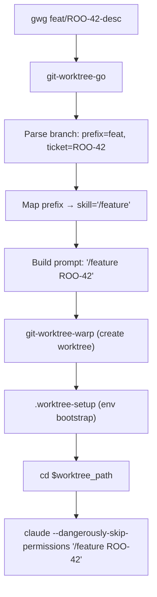
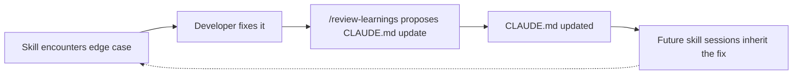
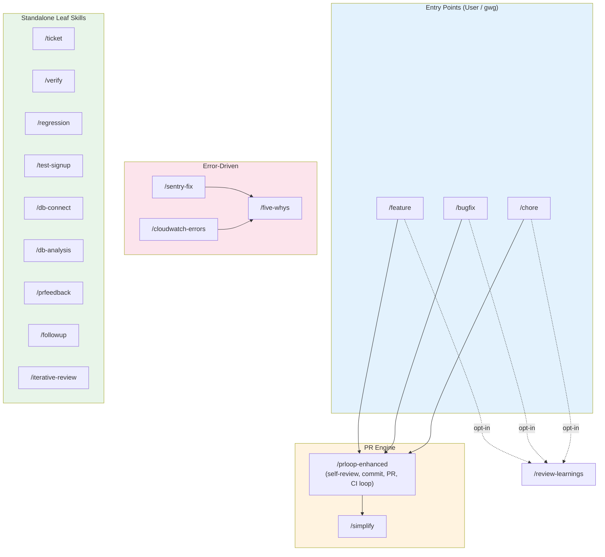
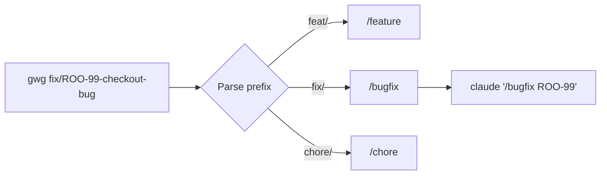
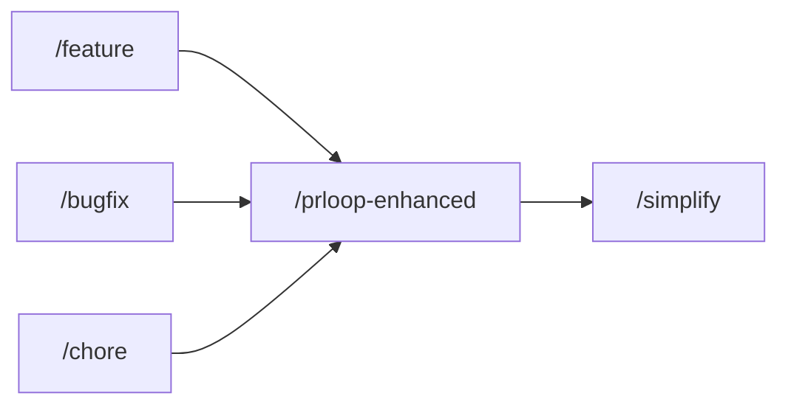
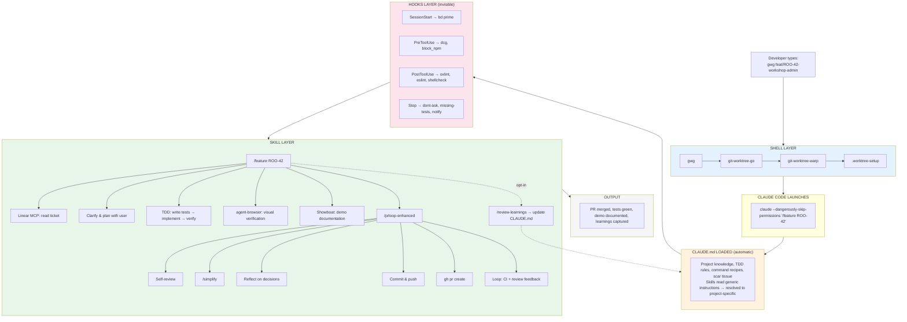

# Composing Claude Code Skills to Automate the SDLC

Raw material for presentation on how custom skills, shell scripts, hooks, and plugins compose together to create an automated software development lifecycle.

The stack has six layers, each building on the ones below:

1. **Shell scripts & worktree automation** — `gwg`, `gww`, `.worktree-setup`
2. **Hooks** — invisible guardrails at both user and project levels (plus git hooks)
3. **CLAUDE.md** — the shared brain / project knowledge base
4. **Project-level skills** — `/feature`, `/bugfix`, `/chore`, `/prloop-enhanced`, and friends
5. **User-level skills & commands** — portable skills (`/prloop`) plus user commands (`/makepr`)
6. **Plugins** — installed capability packs (`code-review`, `code-simplifier`, `frontend-design`, `typescript-lsp`, `telegram`, `vercel`) that contribute their own skills, agents, and hooks

---

## The Big Picture: One Command to Ship a Feature

```
gwg feat/ROO-42-workshop-admin
```

This single shell command:
1. Creates an isolated git worktree branched from `dev`
2. Copies environment files and finds a free dev server port
3. Installs dependencies
4. Launches Claude Code with `--dangerously-skip-permissions`
5. Auto-injects `/feature ROO-42` as the opening prompt

From there, the `/feature` skill takes over and orchestrates the entire workflow end-to-end: reading the ticket, asking questions, planning, TDD, implementation, visual verification, documentation, PR creation, CI monitoring, and review feedback incorporation.

---

## Layer 1: Shell Scripts & Worktree Automation

These are the foundation — they create isolated workspaces and bootstrap Claude Code sessions with the right context.

### `gwg` (git-worktree-go) — The Smart Launcher

**Location:** Shell function in `.zshrc` wrapping `~/src/util-scripts/git-worktree-go`

**What it does:** Parses a branch name to determine which skill to invoke, creates a worktree, and starts Claude Code with the right slash command pre-loaded.

**Branch name convention drives skill selection:**

| Branch prefix | Skill invoked | Example |
|---|---|---|
| `feat/ROO-42-...` | `/feature ROO-42` | Feature development |
| `fix/ROO-99-...` | `/bugfix ROO-99` | Bug fix |
| `chore/ROO-55-...` | `/chore ROO-55` | Maintenance/refactoring |

**Flow:**
```
gwg feat/ROO-42-desc
  └─ git-worktree-go
       ├─ parses branch → prefix=feat, ticket=ROO-42
       ├─ maps prefix → skill="/feature"
       ├─ builds prompt: "/feature ROO-42"
       ├─ calls git-worktree-warp (creates worktree)
       └─ outputs: worktree_path + claude_prompt
  └─ cd $worktree_path
  └─ claude --dangerously-skip-permissions "/feature ROO-42"
```



### `gww` (git-worktree-warp) — The Worktree Creator

**Location:** Shell function in `.zshrc` wrapping `~/src/util-scripts/git-worktree-warp`

**What it does:** Creates a git worktree in a sibling directory, checks out or creates the branch, runs project setup, and launches Claude Code (without a pre-loaded prompt).

**Key behaviors:**
- Creates worktrees at `../<repo>-worktrees/<branch-name>/`
- Handles three branch states: exists locally, exists on remote, or new (from default branch)
- Runs `.worktree-setup` if present in the project

### `gww-clean` (git-worktree-warp-cleanup)

**Location:** Alias in `.zshrc` → `~/src/util-scripts/git-worktree-warp-cleanup`

**What it does:** Safely tears down a worktree — checks for uncommitted changes and unpushed commits before removing. Supports `--force` for overriding safety checks.

**Safety checks:**
- Refuses to run from the main repo (only works in worktrees)
- Blocks if uncommitted changes exist
- Blocks if unpushed commits exist
- Releases allocated ports

### `.worktree-setup` — Project Bootstrap

**Location:** Repository root (committed to the repo)

**What it does:** Runs automatically when a worktree is created via `gww`/`gwg`. Sets up everything needed for an isolated development environment.

**Steps:**
1. Copies `.env.local` files from main worktree (web, rootnote-api, batch-jobs)
2. Copies `amplifyconfiguration.json` from main worktree
3. Finds an available port (3001-3099) for the dev server
4. Updates `PORT`, `ROOT_URL`, `NEXTAUTH_URL` in the copied `.env.local`
5. Sets up beads issue tracker redirect (all worktrees share one database)
6. Checks AWS SSO login status (offers to log in if needed)
7. Runs `pnpm install`

---

## Layer 2: Hooks — Behavioral Guardrails

Hooks are shell commands that fire on Claude Code lifecycle events. They exist at two levels: **user-level** (`~/.claude/settings.json`, portable across projects) and **project-level** (`.claude/settings.json`, committed to the repo). Both layers compose — user hooks fire first, then project hooks.

There's also a third kind: **git hooks** (`.husky/`), which fire on git events rather than Claude events. These enforce quality gates at commit time.

### User-Level Hooks (portable)

These apply to every Claude Code session regardless of project.

#### Stop Hooks

**stop-dont-ask-just-do** — Blocks Claude from stopping if its last message asks the user to run a command Claude could run itself. Scans for patterns like "please run", "you'll need to execute", "aws sso login" in Claude's prose (strips code blocks first to avoid false positives). Forces Claude to use the Bash tool directly instead of delegating to the user.

**stop-notify** — Sends a macOS notification via `terminal-notifier` when Claude finishes, showing the last user message as context. Essential for long-running autonomous sessions where you've switched to another task.

#### PreToolUse Hooks

**dcg (destructive command guard)** — Fires before every Bash tool call. Guards against destructive commands. The stop-dont-ask hook explicitly references dcg as a valid reason for Claude to ask the user for help.

#### Notification Hook

**osascript display notification** — Fires on Claude notification events. Provides native macOS notifications for agent alerts.

### Project-Level Hooks (committed to repo)

These are the project-specific guardrails that enforce RootNote's development standards. They fire on every Write/Edit and every Bash call within this repo.

#### PostToolUse: Inline Linting (fires on every Write/Edit)

Four linting hooks run every time Claude edits a file, creating a **real-time feedback loop** — Claude sees lint errors immediately after writing code, not 10 minutes later in CI:

**oxlint** — Rust-based linter (~5ms per file). Runs first because it's fastest. Handles rules disabled in ESLint via `eslint-plugin-oxlint`. Auto-fixes what it can, reports remaining issues.

**eslint** — Full ESLint with project config. Prefers `eslint_d` (daemon, ~60ms) over cold `eslint` (~700ms). Auto-fixes what it can via `--fix`, reports remaining issues. Walks up from the changed file to find the nearest `eslint.config.mjs`.

**shellcheck** — Static analysis for shell scripts. Catches common bash pitfalls (unquoted variables, unused vars, POSIX compatibility). No auto-fix — reports issues for Claude to address.

**block_test_in_pages** — Blocks test files written inside `web/pages/` (non-API routes). Enforces CLAUDE.md note #15 — test files in pages cause `PageNotFoundError` in production builds. Directs to `web/src/__tests__/pages/` instead.

**block_manual_migration** — Blocks manually created migration SQL files and `_journal.json` edits. Enforces CLAUDE.md note #10 — migrations must be generated with `db:generate`.

All linting hooks share a common framework (`hook_common.bash`) that handles:
- JSON input parsing from Claude Code's hook payload
- File path extraction and pattern matching
- Colored status output (`✓` pass / `✗` fail / `N/A`)
- Error trapping (hooks never crash Claude Code — `trap 'exit 0' ERR`)

#### PreToolUse: Command & Edit Guards

**block_npm_install** (Bash only) — Blocks `npm install/add/ci` commands. Enforces pnpm usage across the monorepo. Allows npm in `amplify/` directory (Lambda functions).

**jj_snapshot** (Bash | Edit | Write) — Snapshots jj working copy before potentially destructive operations (if jj is in use). Fires on file edits and writes as well as bash calls, so any mutation has a recoverable snapshot. Exits silently if jj isn't installed or not in a jj repo.

#### Stop Hook: Test Enforcement

**stop_missing_tests** — Blocks Claude from stopping if source files were changed without any test files being modified. Classifies all changed files as source/test/excluded, and blocks if source-only changes are detected. Includes:
- Smart exclusions: migrations, email templates, config, CI, infrastructure, CSS, images
- Cooldown system: won't block repeatedly in the same session (5-minute cooldown via shared `cooldown` helper)
- File count summary: shows which source files lack test coverage

#### SessionStart / PreCompact

**bd prime** — Fires on session start and before context compaction. Loads beads issue tracker context so Claude always has access to project task state.

#### Notification

**slack-notify** — Present in `.claude/hooks/` but **not currently wired** in `.claude/settings.json` (Notification array is empty). When wired, it sends a Slack notification to `#dev-notifications` when Claude needs input — branch, project name, session ID, and notification type (permission prompt, idle, question), with Block Kit formatting. User-level `osascript` notifications are the active path today.

### Git Hooks (`.husky/`)

These fire on git events, not Claude events. They're the final quality gate before code leaves the local machine.

**pre-commit** — Runs the full quality suite before every commit:
1. `pnpm install` (ensure deps are current)
2. `pnpm --filter @rootnote/web lint --quiet --fix` (lint + auto-fix)
3. `pnpm --filter @rootnote/api lint --quiet` (API lint)
4. `pnpm --filter rootnote-api exec tsc --noEmit` (API typecheck)
5. `pnpm --filter @rootnote/web test:ci` (full test suite)
6. Beads pre-commit hook (issue tracker sync)

**post-merge** — Runs beads post-merge hook for issue tracker sync.

### How Hooks Compose with Skills

Hooks create invisible guardrails that skills don't need to know about. They operate at multiple timescales:

```
/feature ROO-42
  │
  ├─ SESSION START
  │    └─ bd prime → loads issue tracker context
  │
  ├─ CLAUDE WRITES CODE (PostToolUse: Write/Edit)
  │    └─ oxlint → instant lint (~5ms)
  │    └─ eslint → full lint with auto-fix (~60-700ms)
  │    └─ shellcheck → shell script analysis (if .sh file)
  │    └─ block_test_in_pages → rejects tests in web/pages/
  │    └─ block_manual_migration → rejects hand-written SQL migrations
  │
  ├─ CLAUDE RUNS COMMANDS OR WRITES FILES (PreToolUse: Bash|Edit|Write)
  │    └─ dcg → blocks destructive commands (Bash only; rm -rf, git push --force)
  │    └─ block_npm_install → enforces pnpm (Bash only)
  │    └─ jj_snapshot → safety snapshot on Bash|Edit|Write (if jj repo)
  │
  ├─ CLAUDE TRIES TO STOP
  │    └─ stop-dont-ask-just-do → blocks "please run X" delegation
  │    └─ stop_missing_tests → blocks if source changed without tests
  │
  ├─ CLAUDE NEEDS INPUT (Notification)
  │    └─ osascript → macOS notification
  │    └─ slack-notify → #dev-notifications (inactive — hook present, not wired in settings.json)
  │
  ├─ CLAUDE COMMITS (git pre-commit)
  │    └─ lint + typecheck + full test suite (final gate)
  │
  └─ CLAUDE FINISHES (Stop)
       └─ stop-notify → macOS notification
```



```mermaid
flowchart TD
    A["/feature ROO-42"] --> B["SESSION START"]
    A --> C["WRITES CODE"]
    A --> D["RUNS COMMANDS / WRITES FILES"]
    A --> E["TRIES TO STOP"]
    A --> F["NEEDS INPUT"]
    A --> G["COMMITS"]
    A --> H["FINISHES"]

    B --> B1["bd prime → load issue tracker"]

    C --> C1["oxlint → instant lint ~5ms"]
    C --> C2["eslint → full lint + auto-fix ~60-700ms"]
    C --> C3["shellcheck → shell script analysis"]
    C --> C4["block_test_in_pages → reject tests in web/pages/"]
    C --> C5["block_manual_migration → reject hand-written SQL"]

    D --> D1["dcg → block destructive commands (Bash only)"]
    D --> D2["block_npm_install → enforce pnpm (Bash only)"]
    D --> D3["jj_snapshot → safety snapshot (Bash|Edit|Write)"]

    E --> E1["stop-dont-ask-just-do → block delegation"]
    E --> E2["stop_missing_tests → block without tests"]

    F --> F1["osascript → macOS notification"]
    F --> F2["slack-notify → #dev-notifications (inactive)"]

    G --> G1["pre-commit: lint + typecheck + test suite"]

    H --> H1["stop-notify → macOS notification"]

    style B fill:#e8f5e9
    style C fill:#fff3e0
    style D fill:#fce4ec
    style E fill:#f3e5f5
    style F fill:#e3f2fd
    style G fill:#fff8e1
    style H fill:#e8f5e9
```

### The Layered Defense Model

Hooks create **defense in depth** — the same rule is often enforced at multiple levels:

| Rule | Inline Hook (instant) | Stop Hook (before finish) | Git Hook (before commit) | CLAUDE.md (guidance) |
|---|---|---|---|---|
| Tests required | — | stop_missing_tests | pre-commit: test:ci | TDD mandate |
| Lint clean | oxlint + eslint (auto-fix) | — | pre-commit: lint --fix | Pre-commit checklist |
| No npm | block_npm_install | — | — | Package Manager section |
| No tests in pages/ | block_test_in_pages | — | — | Note #15 |
| No manual migrations | block_manual_migration | — | — | Note #10 |
| No destructive commands | dcg | — | — | — |
| Don't delegate to user | — | stop-dont-ask-just-do | — | — |

The instant hooks catch issues at write-time (fastest feedback). The stop hook catches missing tests before Claude declares "done". The git hook is the final safety net. CLAUDE.md provides the _reasoning_ so Claude avoids the pattern in the first place.

---

## Layer 3: CLAUDE.md — The Shared Brain

`CLAUDE.md` is automatically loaded into every Claude Code session. It's the project's institutional knowledge — and it's what makes skills work correctly without each skill needing to encode project-specific details.

### What CLAUDE.md Provides to Skills

Skills are written generically (e.g., "run the test suite", "create a branch"). CLAUDE.md fills in the project-specific details that make those generic instructions concrete:

| Skill needs to... | CLAUDE.md provides... |
|---|---|
| Run tests | `pnpm test:ci:web` (not `npm test`, not `yarn test`) — and the critical warning to NEVER use `test:web` (watch mode hangs in non-interactive shells) |
| Create a branch | Branch from `dev`, not `main` — with naming convention `feat/ROO-XXX-description` |
| Run lint/typecheck | `pnpm lint:web --quiet` + `pnpm --filter @rootnote/web typecheck` |
| Make DB changes | Use `db:generate` to create migrations, NEVER manually create SQL files |
| Choose test type | The full testing pyramid + test type selection guide (unit vs integration vs E2E) |
| Place test files | NEVER in `web/pages/` (causes PageNotFoundError) — use `web/src/__tests__/pages/` |
| Handle pre-commit failures | Retry once, then `--no-verify` if clearly unrelated — note in commit message |
| Verify visually | Authentication flow: try cached Playwright state, fall back to form login, read credentials from `.env.local` |
| Document work | Showboat demo docs go in `demos/<TICKET>.md`, use agent-browser for screenshots |
| Handle memory issues | `NODE_OPTIONS="--max-old-space-size=4096"` |
| Use package managers | `pnpm` everywhere except `amplify/` Lambda functions (yarn). NEVER npm. |

### CLAUDE.md as the TDD Contract

The most impactful section of CLAUDE.md for skill behavior is the **mandatory TDD workflow**. Every orchestrator skill (`/feature`, `/bugfix`, `/chore`) includes a TDD phase, but the _specifics_ of how TDD works in this codebase come from CLAUDE.md:

- **Red → Green → Refactor** cycle is enforced
- The testing pyramid dictates which test type to write
- The "When to Ask the User" section prevents skills from guessing on ambiguous test decisions
- The bug fix TDD pattern (reproduce → verify failure → fix → verify pass) is shared between `/bugfix` and the CLAUDE.md guidelines

This means updating the TDD section in CLAUDE.md changes behavior across ALL orchestrator skills simultaneously — no skill edits needed.

### CLAUDE.md as Scar Tissue

Many CLAUDE.md entries are lessons learned from past incidents. These act as passive guardrails that prevent skills from repeating mistakes:

- **Note #15 (test file placement)**: A production build broke because a test file was placed in `web/pages/`. Now every skill that creates test files inherits this constraint.
- **Note #16-17 (pagination/filter parity)**: Migration bugs where paginated APIs silently dropped results. Skills working on data migration inherit these warnings.
- **Note #18 (PG flag race condition)**: Client-side code using PG flags must gate on `pgFlagsLoaded`. Any skill touching frontend data fetching inherits this.
- **Amplify env vars**: The destructive `update-branch` behavior (replaces, doesn't merge) is documented because it happened. Any skill touching infrastructure inherits this.

### CLAUDE.md ↔ Skill Feedback Loop

`/review-learnings` closes the loop. After a completed feature/bugfix/chore, it analyzes what went wrong or what was non-obvious, and proposes updates to CLAUDE.md. This means:

```
Skill encounters edge case → Developer fixes it → /review-learnings proposes CLAUDE.md update
→ Future skill sessions inherit the fix automatically
```



The skills teach CLAUDE.md, and CLAUDE.md teaches the skills. Neither needs to know about the other's internals.

### CLAUDE.md Sections by Consumer

| CLAUDE.md Section | Primary Skill Consumers | What It Controls |
|---|---|---|
| Common Development Commands | All skills | Exact commands for build/test/lint/db |
| High-Level Architecture | /feature, /bugfix | Codebase navigation, tech stack awareness |
| Important Development Notes | All skills | Hard constraints (scar tissue from incidents) |
| TDD Guidelines | /feature, /bugfix, /chore | Testing methodology and test type selection |
| Pre-Commit Checklist | /prloop-enhanced | Quality gates before commit |
| Demo Documentation | /feature, /bugfix, /verify | Showboat + agent-browser usage |
| Git Workflow | All skills | Branch strategy, commit conventions |
| Security: Credentials | All skills | Never commit secrets |
| Beads Issue Tracker | All skills | Task tracking tool (bd, not TodoWrite) |
| Session Completion | All skills | Mandatory push-before-done protocol |
| Port Configuration | /verify, .worktree-setup | Worktree isolation |

### Why This Matters for Composability

CLAUDE.md is the reason skills can be **generic yet correct**. A skill says "run the tests" and CLAUDE.md resolves that to `pnpm test:ci:web` with the right flags and the right caveats. This separation means:

1. **Skills are portable** — `/prloop-enhanced` could work in another repo with a different CLAUDE.md
2. **Project knowledge is centralized** — updating one CLAUDE.md section fixes all skills
3. **Skills don't duplicate** — no need to encode "use pnpm" in 15 different skill files
4. **Knowledge compounds** — `/review-learnings` adds to CLAUDE.md, benefiting all future sessions

---

## Layer 4: Project-Level Skills — The SDLC Automators

### Skill Dependency Graph

```
                    ┌──────────────────────────────────────────┐
                    │           Entry Points (User)            │
                    └──────────────────────────────────────────┘
                         │            │            │
                    ┌────▼───┐  ┌─────▼────┐  ┌───▼────┐
                    │/feature│  │ /bugfix   │  │ /chore │
                    └────┬───┘  └─────┬────┘  └───┬────┘
                         │            │            │
                         ▼            ▼            ▼
                    ┌──────────────────────────────────────┐
                    │         /prloop-enhanced              │
                    │  (self-review, commit, PR, CI loop)   │
                    └──────────────┬───────────────────────┘
                                   │
                              ┌────▼─────┐
                              │ /simplify │
                              └──────────┘

  ┌─────────────┐     ┌───────────┐
  │/sentry-fix  │────▶│/five-whys │
  └─────────────┘     └───────────┘
                            ▲
  ┌──────────────────┐      │
  │/cloudwatch-errors│──────┘
  └──────────────────┘

  Post-completion (opt-in):
  /feature ──┐
  /bugfix  ──┼──▶ /review-learnings
  /chore   ──┘

  Standalone leaf skills:
  /ticket  /verify  /regression  /test-signup  /followup
  /db-connect  /db-analysis  /prfeedback  /iterative-review
```



### Orchestrator Skills (call other skills)

#### `/feature` — End-to-End Feature Development

**Trigger:** `/feature ROO-XXX` or auto-injected by `gwg feat/...`

**Phases:**
1. Read Linear ticket → extract intent, scope, edge cases
2. Ask clarifying questions (if ambiguous)
3. Generate & confirm acceptance criteria with user
4. Plan implementation (files, steps, testing strategy)
5. Set up branch (or use existing worktree branch)
6. **TDD implementation** — write failing tests first, then implement
7. Run full verification suite (tests, lint, typecheck)
8. Visual verification with agent-browser/chrome-devtools (authenticate, screenshot)
9. Showboat documentation (demo doc with evidence)
10. **Delegate to `/prloop-enhanced`** for commit, PR, CI loop
11. Report with acceptance criteria checklist
12. Optionally invoke `/review-learnings`

**Composes:** Linear MCP, agent-browser, chrome-devtools, Showboat, `/prloop-enhanced`, `/simplify` (via prloop), `/review-learnings`

#### `/bugfix` — Bug Fix with Root Cause Analysis

**Trigger:** `/bugfix ROO-XXX` or auto-injected by `gwg fix/...`

**Same phase structure as `/feature`** but with bug-specific analysis:
- Phase 1 focuses on root cause diagnosis, not feature intent
- Phase 6 follows strict TDD: write test that reproduces bug → verify it fails → fix → verify it passes
- Phase 8 visual verification confirms the bug is fixed in the browser

**Composes:** Same as `/feature`

#### `/chore` — Maintenance & Refactoring

**Trigger:** `/chore ROO-XXX` or auto-injected by `gwg chore/...`

**Key difference from feature/bugfix:** Classifies the chore type to determine testing strategy:

| Chore Type | Tests Needed? | Visual Verification? |
|---|---|---|
| Refactoring | Yes — existing tests must stay green | Only if UI touched |
| Dependency update | Yes — full suite + breaking change tests | Only if UI libs |
| CI/CD | No — verify pipeline runs | No |
| Tooling/DX | No — verify tools work | No |
| Infrastructure | No — verify plan/apply | No |
| Cleanup/deletion | Yes — existing tests must pass | No |

**Composes:** Same as `/feature`

#### `/prloop-enhanced` — The PR Engine

**Trigger:** Called by `/feature`, `/bugfix`, `/chore` — rarely invoked directly

**What it does:** The shared final mile for all three orchestrators.

**Phases:**
1. **Self-review** — Reads its own diff and fixes issues before anyone sees them (unused imports, null refs, security concerns, missing tests)
2. **Code simplification** — Invokes `/simplify` to refine changed code
3. **Implementation reflection** — Documents hardest decision, rejected alternatives, least confident areas (goes into PR description)
4. **Commit and push** — Conventional commits with ticket ID
5. **Create/update PR** — Comprehensive description with reflection section
6. **Monitor and loop** — Two parallel tracks:
   - Track A: Poll for Claude Code Review (fast, 2-5 min) → address feedback immediately
   - Track B: Monitor full CI suite (slower, 10-20 min) → fix failures
7. **Loop until green** — All CI checks pass, all review comments addressed

**Composes:** `/simplify`, GitHub API (gh), codex CLI (optional local AI review)

#### `/sentry-fix` — Error-Driven Development

**Trigger:** `/sentry-fix` (no ticket needed)

**Flow:**
1. Browse unresolved Sentry issues
2. User selects one
3. Runs `/five-whys` root cause analysis
4. Creates a Linear issue with analysis
5. Sets up a worktree
6. Begins implementation

**Composes:** Sentry CLI, `/five-whys`, Linear MCP

#### `/cloudwatch-errors` — Production Log Analysis

**Trigger:** `/cloudwatch-errors`

**Flow:**
1. Query CloudWatch logs for errors
2. Deduplicate and prioritize
3. Run Five Whys on selected errors
4. Create Linear issues with recommendations

**Composes:** AWS CloudWatch, `/five-whys`, Linear MCP

### Leaf Skills (standalone, no downstream calls)

#### `/ticket` — Issue Creation
Takes a rough description, asks clarifying questions, explores codebase for context, drafts a well-structured Linear issue. The output is ready to feed into `/bugfix` or `/feature`.

**Composes:** Linear MCP

#### `/verify` — Quick Visual Verification
Starts dev server, authenticates (cached Playwright state or form login), captures screenshots with agent-browser or chrome-devtools. Lightweight alternative to the full verification phases in orchestrator skills.

**Composes:** agent-browser, chrome-devtools, Showboat

#### `/regression` — E2E Regression Testing
Checks for active Amplify builds (waits if needed), then runs Playwright E2E tests against dev or prod. Wraps `scripts/run-regression.sh` with Amplify awareness.

**Composes:** AWS Amplify, Playwright

#### `/test-signup` — Real Sign-Up Flow Testing
Performs actual E2E sign-up using browser automation, reads verification email from S3 (via SES), enters OTP, optionally completes onboarding, cleans up test user.

**Composes:** agent-browser, chrome-devtools, AWS SES/S3, Cognito

#### `/five-whys` — Root Cause Analysis
Structured Five Whys analysis. Iteratively questions, investigates codebase, and synthesizes into a root cause statement with recommendations.

**Composes:** Codebase search only (no external tools)

#### `/review-learnings` — Meta-Improvement
Analyzes session logs and diffs from completed work. Proposes updates to CLAUDE.md, skills, or testing guidelines — only changes with compounding value. Called opt-in by orchestrators after PR is green.

**Composes:** None (advisory output)

#### `/prfeedback` — Ad-Hoc Review Loop
Like `/prloop-enhanced`'s feedback phase, but standalone. For when a PR already exists and has accumulated review comments to address.

**Composes:** GitHub API (gh)

#### `/followup` — Linear-First Follow-Up Capture
Captures a follow-up item surfaced during a PR, review, or investigation. Enforces Linear-first discipline: creates a Linear issue (never a bare beads issue), cross-links it to the source PR or parent ticket (`ROO-xxxx` detected via branch/body scan), and optionally mirrors it as a linked beads issue for local execution tracking. Can reply directly on an inline PR review-comment thread if the comment URL is in scope.

**Composes:** Linear MCP, GitHub API (gh), beads

#### `/iterative-review` — Local Mirror of the GH Reviewer
Runs a local code review that mirrors the GitHub Action Claude Code Reviewer, then fixes findings and re-reviews until convergence (up to 4 iterations). Each iteration spawns **four parallel subagents** — a generalist plus three narrow specialists (scale/N+1, silent-failure semantics, security & API-surface) — because specialist concerns routinely get lost in the breadth of a generalist checklist. Purpose: convert the slow push-and-wait cycle into a fast local loop so the GH Action finds little on push.

**Composes:** `code-review-architect` subagent (parallel fan-out)

#### `/simplify` — Code Refinement
Reviews recently modified code for clarity, consistency, and maintainability. Called automatically by `/prloop-enhanced` before committing.

**Composes:** None (code transformation only)

#### `/db-connect` — Database Connection Setup
Discovers RDS endpoints from AWS, sets up SSM tunnels for VPC-only clusters, introspects schema. Preparation for `/db-analysis`.

**Composes:** AWS RDS, AWS Secrets Manager, AWS SSM

#### `/db-analysis` — SQL Analysis
Connects to RDS databases and runs analysis queries with strict credential safety. Standalone or follows `/db-connect`.

**Composes:** AWS RDS, AWS Secrets Manager, AWS SSM

---

## Layer 5: User-Level Skills & Commands

Two surfaces live outside the repo:

- **Skills** at `~/.claude/skills/` — full SKILL.md procedures, portable across projects.
- **Commands** at `~/.claude/commands/` — lighter slash commands (single `.md` files, optionally grouped into namespaced folders).

### User-Level Skills (`~/.claude/skills/`)

#### `/prloop` — Portable PR Workflow

The user-level version of `/prloop-enhanced`. Same core workflow (self-review → simplify → reflect → commit → PR → CI loop) but without project-specific assumptions. The project-level `/prloop-enhanced` overrides this within the RootNote repo.

**Key difference from project-level:** The user-level version is portable across any repo. The project-level version adds RootNote-specific conventions (commit format, test commands, `dev` branch target).

> Note: `/prloop` also exists as a lightweight user-level command at `~/.claude/commands/prloop.md` (thinner than the skill). Command resolution prefers the skill when both exist with the same name.

### User-Level Commands (`~/.claude/commands/`)

#### `/makepr`

A simpler alternative to the full prloop. Just analyzes changes, creates a branch, commits, pushes, and opens a PR via `gh`. No self-review, no simplification, no CI loop. For small changes where the full workflow is overkill.

---

## Layer 6: Plugins — Installed Capability Packs

Plugins are versioned bundles that ship skills, subagents, slash commands, and sometimes hooks together. They're installed via the Claude plugin system and enabled in `~/.claude/settings.json` under `enabledPlugins`. Unlike user-level skills (which you maintain by hand), plugins are managed, version-pinned, and updated like dependencies.

### Currently Enabled

| Plugin | Version | What it adds |
|---|---|---|
| **code-review** | — | `/code-review:code-review` skill — structured PR review. Complements the local `/iterative-review` (which mimics the GH Action), giving a manual one-shot review as an alternative. |
| **code-simplifier** | 1.0.0 | `/simplify` skill + `code-simplifier:code-simplifier` subagent. This is now the canonical source of `/simplify` (previously a user-level skill). Called automatically by `/prloop-enhanced` before commit. |
| **frontend-design** | — | `/frontend-design:frontend-design` skill — distinctive, production-grade frontend UI generation that avoids generic AI aesthetics. Useful inside `/feature` when building novel UI. |
| **typescript-lsp** | 1.0.0 | TypeScript Language Server integration — richer go-to-definition / diagnostics than grep-based exploration. Upgrades `/feature` and `/bugfix` investigation quality on the TS side of the monorepo. |
| **telegram** | 0.0.6 | Bidirectional Telegram channel — `/telegram:configure`, `/telegram:access`, plus a reply/react/edit tool surface. Messages arrive as `<channel source="telegram">` tags mid-session; replies go through the `reply` tool. Enables out-of-band nudges and remote status pings during long autonomous runs. |
| **vercel** | 0.40.0 | Large bundle: subagents (`vercel:ai-architect`, `vercel:deployment-expert`, `vercel:performance-optimizer`) + skills for AI SDK, Chat SDK, Next.js, env vars, deployments, storage, functions, middleware, cache-components, knowledge updates, verification, React best practices, and more. When working on Vercel-hosted surfaces, these short-circuit a lot of documentation lookup. |

### Why Plugins Matter for Composability

Plugins are the mechanism that lets **other people's skills plug into your local stack** without you having to fork or rewrite them. They compose with the rest of the stack the same way custom skills do:

- Plugin skills are resolved alongside project + user skills at invocation time.
- They inherit the same guardrails: project hooks still fire on every tool use, CLAUDE.md is still loaded, the destructive-command guard still runs.
- A plugin can ship its own subagents, which local orchestrators can call by name (e.g., `/prloop-enhanced` can invoke `code-simplifier:code-simplifier`).

### Resolution Order (mental model)

When a name collides, resolution prefers the narrower / more specific scope:

```
Project-level skill   (.claude/skills/)     ← most specific
  > User-level skill  (~/.claude/skills/)
  > Plugin skill      (plugins/.../skills/)
  > User-level command (~/.claude/commands/) ← fallback for plain /name
```

This is why `/prloop-enhanced` (project) overrides `/prloop` (user) inside the RootNote repo, and why `/simplify` now comes from the `code-simplifier` plugin even though it used to live user-level.

---

## Composability Patterns

### Pattern 1: Convention-Based Routing

Branch name → skill selection happens entirely in shell, before Claude Code starts:

```
gwg fix/ROO-99-checkout-bug
     │
     ├─ prefix "fix" → skill "/bugfix"
     ├─ ticket "ROO-99" → argument
     └─ result: claude "/bugfix ROO-99"
```



No configuration, no flags. The branch naming convention IS the interface.

### Pattern 2: Shared Final Mile

All three orchestrators (`/feature`, `/bugfix`, `/chore`) converge on the same PR engine:

```
/feature ──┐
/bugfix  ──┼──▶ /prloop-enhanced ──▶ /simplify
/chore   ──┘
```



Changes to the PR workflow (adding codex review, adding reflection) propagate to all three automatically.

### Pattern 3: Invisible Guardrails (Hooks)

Skills don't need defensive code for common mistakes — hooks catch them:

- Claude tries to ask user to run a command → **stop hook blocks it**
- Claude tries a destructive command → **dcg blocks it**
- Claude finishes work → **notification fires automatically**

Skills stay focused on their domain logic. Guardrails are orthogonal.

### Pattern 4: Layered Override

User-level `/prloop` provides a portable baseline. Project-level `/prloop-enhanced` overrides it with RootNote-specific behavior. The skill resolution order (project > user) makes this automatic.

### Pattern 5: Opt-In Meta-Improvement

`/review-learnings` is called at the end of orchestrators but only with user consent. It closes the feedback loop: skills that automate the SDLC also improve themselves over time.

### Pattern 6: Environment Isolation via Worktrees

`.worktree-setup` ensures each parallel workstream gets:
- Its own branch
- Its own port (auto-discovered from 3001-3099)
- Its own env files (copied from main, then port-patched)
- Shared beads database (via redirect file)

This means you can run `gwg feat/ROO-42-...` and `gwg fix/ROO-99-...` simultaneously in separate terminals.

---

## The Full Stack: From Shell to Ship

```
┌─────────────────────────────────────────────────────────────────┐
│                     Developer types:                             │
│                     gwg feat/ROO-42-workshop-admin               │
└──────────────────────────┬──────────────────────────────────────┘
                           │
┌──────────────────────────▼──────────────────────────────────────┐
│  SHELL LAYER                                                     │
│  gwg → git-worktree-go → git-worktree-warp → .worktree-setup   │
│  Branch parsed → worktree created → env bootstrapped            │
└──────────────────────────┬──────────────────────────────────────┘
                           │
┌──────────────────────────▼──────────────────────────────────────┐
│  CLAUDE CODE LAUNCHES                                            │
│  claude --dangerously-skip-permissions "/feature ROO-42"        │
└──────────────────────────┬──────────────────────────────────────┘
                           │
┌──────────────────────────▼──────────────────────────────────────┐
│  CLAUDE.md LOADED (automatic)                                    │
│  Project knowledge, TDD rules, command recipes, scar tissue     │
│  Skills read generic instructions; CLAUDE.md resolves them      │
│  to project-specific commands, constraints, and conventions     │
└──────────────────────────┬──────────────────────────────────────┘
                           │
┌──────────────────────────▼──────────────────────────────────────┐
│  HOOKS LAYER (invisible)                                         │
│  SessionStart → beads prime                                      │
│  PreToolUse:Bash → dcg (destructive command guard)              │
│  Stop → dont-ask-just-do + notification                         │
└──────────────────────────┬──────────────────────────────────────┘
                           │
┌──────────────────────────▼──────────────────────────────────────┐
│  SKILL LAYER                                                     │
│                                                                  │
│  /feature ROO-42                                                 │
│    ├─ Linear MCP: read ticket                                   │
│    ├─ Clarify & plan with user                                  │
│    ├─ TDD: write tests → implement → verify                    │
│    │   (CLAUDE.md: use pnpm test:ci:web, testing pyramid,       │
│    │    test file placement rules, bug fix TDD pattern)         │
│    ├─ agent-browser: visual verification + screenshots          │
│    ├─ Showboat: demo documentation                              │
│    └─ /prloop-enhanced                                          │
│         ├─ Self-review (catch own mistakes)                     │
│         ├─ /simplify (refine code)                              │
│         ├─ Reflect (document decisions)                         │
│         ├─ Commit & push (CLAUDE.md: branch from dev,           │
│         │   conventional commits, pre-commit checklist)         │
│         ├─ gh pr create                                         │
│         └─ Loop: CI checks + review feedback until green        │
│                                                                  │
│  Optional: /review-learnings → update CLAUDE.md & skills        │
│            (closes the feedback loop — skills improve CLAUDE.md │
│             which improves future skill sessions)               │
└──────────────────────────┬──────────────────────────────────────┘
                           │
┌──────────────────────────▼──────────────────────────────────────┐
│  OUTPUT                                                          │
│  PR merged, tests green, demo documented, learnings captured    │
└─────────────────────────────────────────────────────────────────┘
```



---

## Skill Inventory Summary

| Skill | Type | Layer | Calls | Called By |
|---|---|---|---|---|
| `/feature` | Orchestrator | Project skill | prloop-enhanced, review-learnings | User / gwg |
| `/bugfix` | Orchestrator | Project skill | prloop-enhanced, review-learnings | User / gwg |
| `/chore` | Orchestrator | Project skill | prloop-enhanced, review-learnings | User / gwg |
| `/prloop-enhanced` | Orchestrator | Project skill | simplify (plugin) | feature, bugfix, chore |
| `/sentry-fix` | Orchestrator | Project skill | five-whys | User |
| `/cloudwatch-errors` | Orchestrator | Project skill | five-whys | User |
| `/prfeedback` | Leaf | Project skill | — | User |
| `/followup` | Leaf | Project skill | — | User (post-PR, post-review) |
| `/iterative-review` | Leaf | Project skill | code-review-architect ×4 | User |
| `/five-whys` | Leaf | Project skill | — | sentry-fix, cloudwatch-errors |
| `/review-learnings` | Leaf | Project skill | — | feature, bugfix, chore |
| `/ticket` | Leaf | Project skill | — | User |
| `/verify` | Leaf | Project skill | — | User |
| `/regression` | Leaf | Project skill | — | User |
| `/test-signup` | Leaf | Project skill | — | User |
| `/db-connect` | Leaf | Project skill | — | User |
| `/db-analysis` | Leaf | Project skill | — | User |
| `/prloop` | Orchestrator | User skill | simplify (plugin) | User |
| `/makepr` | Leaf | User command | — | User |
| `/simplify` | Leaf | Plugin (code-simplifier) | — | prloop-enhanced |
| `/code-review:code-review` | Leaf | Plugin (code-review) | — | User |
| `/frontend-design:frontend-design` | Leaf | Plugin (frontend-design) | — | User (/feature for UI) |
| `/vercel:*` (~20) | Various | Plugin (vercel) | Vercel subagents | User |
| `/telegram:*` | Config | Plugin (telegram) | — | User |

| Script | What | Where |
|---|---|---|
| `gwg` | Smart launcher (branch → skill) | `.zshrc` function |
| `gww` | Worktree creator + Claude launch | `.zshrc` function |
| `gww-clean` | Safe worktree teardown | `.zshrc` alias |
| `.worktree-setup` | Project env bootstrap | Repo root (committed) |

| Hook | Event | Level | Purpose |
|---|---|---|---|
| **User-level (portable)** | | | |
| stop-dont-ask-just-do | Stop | User | Block "please run X" delegation |
| stop-notify | Stop | User | macOS notification on finish |
| dcg | PreToolUse:Bash | User | Block destructive commands |
| osascript notification | Notification | User | macOS notification for alerts |
| **Project-level (repo-specific)** | | | |
| oxlint | PostToolUse:Write/Edit | Project | Fast Rust-based lint (~5ms), auto-fix |
| eslint | PostToolUse:Write/Edit | Project | Full ESLint with auto-fix (~60-700ms) |
| shellcheck | PostToolUse:Write/Edit | Project | Shell script static analysis |
| block_test_in_pages | PostToolUse:Write/Edit | Project | Reject tests in web/pages/ |
| block_manual_migration | PostToolUse:Write/Edit | Project | Reject hand-written SQL migrations |
| block_npm_install | PreToolUse:Bash | Project | Enforce pnpm (block npm install) |
| jj_snapshot | PreToolUse:Bash/Edit/Write | Project | Safety snapshot for jj repos |
| stop_missing_tests | Stop | Project | Block if source changed without tests |
| bd prime | SessionStart + PreCompact | Project | Load beads issue tracker context |
| slack-notify | Notification | Project | **Present but not currently wired** — hook exists in `.claude/hooks/`; `.claude/settings.json` Notification array is empty |
| **Git hooks (.husky/)** | | | |
| pre-commit | git commit | Git | Lint + typecheck + full test suite |
| post-merge | git merge | Git | Beads issue tracker sync |

---

## Presentation Quick-Hit: What's New Since v1 of This Doc

Use this as a talking-points cheat sheet when walking the audience through the evolution.

1. **Plugins are now a first-class layer.** Six enabled: `code-review`, `code-simplifier` (owns `/simplify` now), `frontend-design`, `typescript-lsp`, `telegram`, `vercel`. This replaced hand-rolled user-level skills with managed, versioned, shareable capability packs.
2. **New project skills**: `/followup` (Linear-first follow-up capture with PR/branch scanning) and `/iterative-review` (four parallel specialist reviewers, locally, to pre-empt the GH Action reviewer).
3. **`/simplify` moved from user-skill to plugin.** Same capability, now version-managed under `code-simplifier`.
4. **Telegram is a real I/O channel now.** The agent can receive messages and reply mid-session, complementing Slack/macOS notifications for out-of-band coordination during long autonomous runs.
5. **Vercel plugin short-circuits a lot of lookup work** on Vercel-hosted surfaces — subagents for AI architecture, deployments, and performance, plus skills for Next.js, AI SDK, Chat SDK, env vars, cache components, functions, and more.
6. **`slack-notify` is parked, not gone.** Hook script still lives in `.claude/hooks/` but isn't wired in `.claude/settings.json` right now. Worth mentioning honestly rather than pretending it's on.
7. **Resolution order matters.** Project skills win over user skills win over plugin skills. That's why `/prloop-enhanced` (project) overrides `/prloop` (user) in this repo, and why `/simplify` cleanly transitioned from user-skill to plugin without breaking callers.
8. **The layered-defense story still holds.** Same rule (missing tests, destructive commands, npm-blocking, test-file-placement) enforced at multiple timescales — that's the headline, not any one hook.
